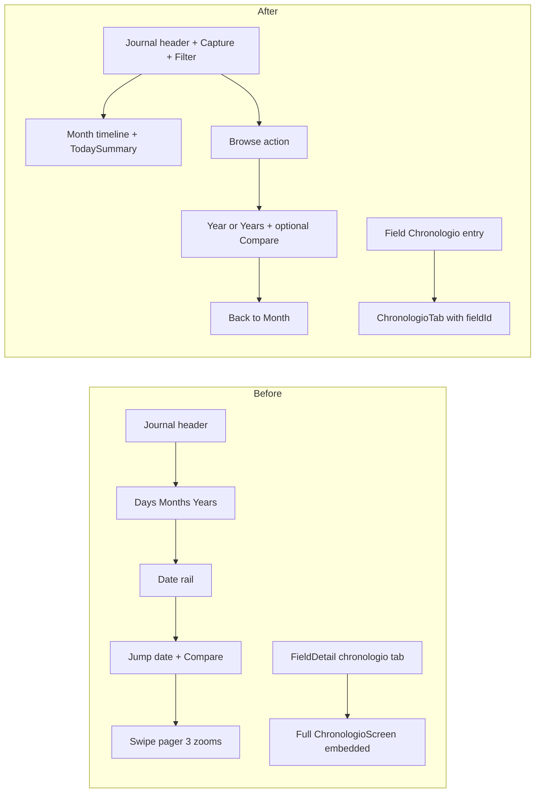

# Chronologio month-first (mobile P0 #2)

- **Date:** 2026-10-01 (Europe/Athens, UTC+3)
- **Scope:** Mobile app only (`mobile/src`). **Plan only — no product code in this pass.**
- **Depends on:** Harvest Today-first (P0 #1) — same mental model (calm default + overflow for secondary modes).
- **Source:** [`docs/AgroTrack-mobile-simplification-report.md`](AgroTrack-mobile-simplification-report.md) P0 Chronologio.

---

## Feature choice

**Second mobile simplification:** Chronologio living journal — first paint is **month timeline only** (TodaySummary + days + Capture), not an analytics zoom tray.

**Out of scope:** web Chronologio, peeks/event-card internals, harvest-day merge logic, Field overview slim (P0 #3), My Oil / Money / Photos.

---

## Current problem

[`ChronologioScreen.tsx`](../mobile/src/screens/ChronologioScreen.tsx) (~1646 lines, crowding **5/5**) paints **all** of these as peers on first viewport:

| Chrome | Role today |
|--------|------------|
| `ChronologioJournalHeader` | Period title, field context, Capture, Filters |
| `ChronologioZoomTabs` | Peer **Days / Months / Years** (`month \| year \| years`) |
| `ChronologioDateRail` | Jump across years while on month/year |
| Jump-to-date + Compare link | Tools row under the rail |
| Filter chips strip | Active filters |
| `ChronologioZoomPager` | Swipe between all three zooms (keeps year/years warm) |
| `TodaySummary` | Only on month page, but buried under the chrome stack |

[`FieldDetailScreen.tsx`](../mobile/src/screens/FieldDetailScreen.tsx) **mounts the full journal again** when `mode === 'chronologio'`:

```tsx
<ChronologioScreen fieldId={field.id} embedded />
```

Stack deep link [`ChronologioStackRedirect`](../mobile/src/screens/ChronologioStackRedirect.tsx) sends `Chronologio/:fieldId` → `FieldDetail` + `mode: 'chronologio'`, which **forces the embed**. Overview “See all”, More menu, and attention actions also set that local tab.

Farmer job on phone: **what happened this month / today** — not “pick a zoom, then filter, then compare seasons.”



---

## Chosen approach

**In-place month shell + Browse overflow + single journal surface** (same pattern as Harvest Today-first / Season). One concrete path — no alternate options left open.

### 1. Default chrome = month only

- First paint always `zoom === 'month'` (current default state stays).
- **Remove** peer `ChronologioZoomTabs` from the default shell.
- **Do not mount** `ChronologioZoomPager` as a 3-page swipe on first paint — mount **only the month timeline body** so accidental swipe cannot open year/years.
- Keep on first paint: `ChronologioJournalHeader` (period label + prev/next month + Today return + Capture + Filters), `TodaySummary` as list header, days timeline, active-filter chips when dirty, starter/first-observation banners as today.
- **Remove from month first paint:** `ChronologioDateRail`, jump-to-date `FormDateField` tools row, Compare link.

### 2. Browse overflow (year / years / compare)

- When `zoom === 'month'`, add a compact **Browse** header action (mirror Harvest **Season** — overflow control, not a fourth peer tab). Prefer extending `ChronologioJournalHeader` with an optional Browse button rather than resurrecting zoom tabs.
- Browse opens `ActionSheet` / small `Sheet` with:
  - **Months** → `setZoom('year')` (existing year-chapters body)
  - **Years** → `setZoom('years')`
  - **Jump to a day** → date picker (reuse `living.jumpToDate` / existing `jumpToDate`)
  - **Compare seasons** → `setZoom('years')` + `compareOpen = true` (only if ≥2 year summaries; else omit or disable)
- Reuse existing labels where possible (`living.zoom.year` / `living.zoom.years` / `living.compare` / `living.jumpToDate`). Add short keys for Browse title + **Back to Month**.

### 3. Secondary chrome

- When `zoom !== 'month'`, replace Browse with a single **← Month** (or Back to Month) row + current period title (year number / “Years”).
- Show year body or years list (reuse existing chapter cards / compare panel). Date rail may appear **only** on year/years secondary shells if still useful for jumping years — never on month default.
- `setZoom('month')` + land on current/live month restores the calm shell (reuse `landDaysOnCurrentPeriod` / `returnToToday` patterns).
- Period prev/next chevrons: month shell shifts months; secondary year shell shifts `periodYear` as today.

### 4. Filters stay behind Filter (already correct)

- Keep the existing Filters sheet + header options button + dismissible active chips. Do **not** merge filters into Browse; Browse = temporal modes, Filter = type/field/lifecycle.
- Field-scoped journal (`fieldId` set): hide “all fields” chip picker in the filter sheet (already gated by `fieldMode`).

### 5. Stop embedding; deep-link field-scoped Chronologio

**Single journal surface** — FieldDetail never mounts `ChronologioScreen`.

| Entry today | Change to |
|-------------|-----------|
| Field local tab `chronologio` | Selecting Timeline **navigates** to Chronologio with `fieldId` (does not switch to an embedded panel). Keep tab in `FIELD_PAGE_TABS` as the entry affordance, or treat press as navigate-and-leave-overview-selected — prefer: on press call intent, leave FieldDetail on overview so back returns to the grove. |
| Overview `FieldRecentChronologio` See all | Same intent with `fieldId` |
| `FieldMoreMenu` / attention `chronologio` | Same intent |
| Stack `Chronologio/:fieldId?` | Redirect to **Main → ChronologioTab** with `fieldId` (not FieldDetail embed) |
| `FieldDetail?mode=chronologio` | On focus, redirect once to ChronologioTab with `fieldId`, then clear/replace so FieldDetail is not left on an empty chronologio panel |
| `FirstObservationGuide` / invite flows that use FieldDetail chronologio | Point at Chronologio + `fieldId` |

**Params (preserve + extend):**

- `MainTabParamList.ChronologioTab`: `{ fieldId?: string } | undefined` (today is `undefined` only).
- Root `Chronologio: { fieldId?: string }` stays; redirect target changes.
- Optional later: `zoom?: 'month' | 'year' | 'years'` on the tab for rare deep links — **not required** for this PR if Browse is enough; month default is mandatory.

**Intent helper** in [`intents.ts`](../mobile/src/navigation/intents.ts):

```ts
openChronologioHome(navigation)           // unchanged — all fields
openChronologioField(navigation, fieldId) // Main → ChronologioTab { fieldId }
```

`ChronologioScreen` keeps reading `fieldId` from route params (and may drop `embedded` / prop injection once FieldDetail no longer embeds). Field mode behavior (scoped API, no field filter chips, context label = grove name) stays.

Clearing field scope: when opening from Launcher / `openChronologioHome`, navigate without `fieldId` (or explicitly clear params) so the global journal does not stick on the last grove.

### 6. Light declutter only (same PR)

- No rewrite of peek sheets, timeline rows, harvest-day merge, or TodaySummary content.
- Drop `embedded` prop path once unused.
- i18n en / el / it for Browse, Back to Month, and any new a11y labels.

---

## Files to change

| File | Change |
|------|--------|
| [`mobile/src/screens/ChronologioScreen.tsx`](../mobile/src/screens/ChronologioScreen.tsx) | Month-only default shell; Browse sheet; secondary back chrome; stop mounting 3-page pager on month; remove rail/tools from month first paint; drop `embedded` when unused |
| [`mobile/src/components/chronologio/ChronologioJournalHeader.tsx`](../mobile/src/components/chronologio/ChronologioJournalHeader.tsx) | Optional Browse action slot (mirror Capture/Filters) |
| [`mobile/src/screens/FieldDetailScreen.tsx`](../mobile/src/screens/FieldDetailScreen.tsx) | Remove `<ChronologioScreen … embedded />`; chronologio tab / See all / attention → `openChronologioField`; handle legacy `mode=chronologio` redirect |
| [`mobile/src/screens/ChronologioStackRedirect.tsx`](../mobile/src/screens/ChronologioStackRedirect.tsx) | `fieldId` → ChronologioTab with params; no FieldDetail embed |
| [`mobile/src/navigation/types.ts`](../mobile/src/navigation/types.ts) | `ChronologioTab: { fieldId?: string } \| undefined` |
| [`mobile/src/navigation/intents.ts`](../mobile/src/navigation/intents.ts) | `openChronologioField` |
| [`mobile/src/navigation/RootNavigator.tsx`](../mobile/src/navigation/RootNavigator.tsx) | Linking still `chronologio/:fieldId?`; ensure tab can receive params |
| Call sites | `FirstObservationGuide`, invite accept chronologio opens, any `setParams({ mode: 'chronologio' })` that expected an embed |
| Locales `en` / `el` / `it` [`chronologio.json`](../mobile/src/locales/en/chronologio.json) | Browse, Back to Month, sheet title |

Optional: tiny `ChronologioBrowseSheet` under `mobile/src/components/chronologio/` only if Browse + back bar clutter the screen (~40+ lines). Prefer inline first (Harvest plan pattern).

**Unchanged this pass:** `ChronologioDaysTimeline`, `TodaySummary`, peek sheets, compare panel internals, month/year chapter cards, services, web frontend.

---

## Explicit non-goals

- No web Chronologio parity or redesign.
- No Field overview card slim (separate P0 #3).
- No AppDock / Launcher redesign.
- No deletion of year/years/compare features — only how you reach them.
- No rewrite of filters, peeks, harvest-day cards, or weather strips.
- No new stack screen for “Chronologio Year” — stay in-place secondary modes like Harvest.

---

## Acceptance criteria

1. Opening Chronologio (Launcher / ChronologioTab) shows **no** Days/Months/Years segmented control and **no** date rail / jump-date / compare on first paint; first scroll is TodaySummary (when live month) + day timeline + Capture.
2. Farmer can open Months, Years, Jump to day, and Compare from **Browse**; **Back to Month** restores the calm shell.
3. Swiping on the month journal does **not** switch to year/years.
4. Field Timeline tab / See all / More / attention open **ChronologioTab with that `fieldId`** — FieldDetail does **not** mount a second full journal.
5. Deep links `chronologio/:fieldId` and legacy `FieldDetail?mode=chronologio` still land on a **field-scoped** journal (same APIs/`fieldMode` behavior), with a path back to FieldDetail via normal stack/tab back.
6. Global Chronologio (no `fieldId`) still works; opening home clears a stuck field scope.
7. Filters sheet + Capture + return-to-today still work on the month shell.
8. el / en / it strings present for new Browse chrome.
9. Idle banners (first grove / first observation / work setup) still appear when applicable.

---

## Actionable todos

1. **month-shell** — Remove zoom tabs + 3-page pager + date rail + tools row from month first paint; mount month timeline + TodaySummary only.
2. **browse-overflow** — Add Browse header action → ActionSheet/Sheet (Months / Years / Jump to day / Compare); wire existing `setZoom` / `compareOpen` / `jumpToDate`.
3. **secondary-back** — When `zoom !== 'month'`, show Back to Month + mode title; render existing year/years bodies (rail optional on secondary only).
4. **field-deeplink** — Extend ChronologioTab params; `openChronologioField`; rewrite ChronologioStackRedirect; remove FieldDetail embed; migrate See all / tab / More / attention / FirstObservationGuide / mode=chronologio.
5. **i18n** — en / el / it for Browse, Back to Month, sheet a11y.

---

## Related

- Report: [`docs/AgroTrack-mobile-simplification-report.md`](AgroTrack-mobile-simplification-report.md)
- Prior P0 pattern: Harvest Today-first (Season overflow + Back to Today)
- Next after this: Field overview slim (identity + attention + CTA; rest under See more)
